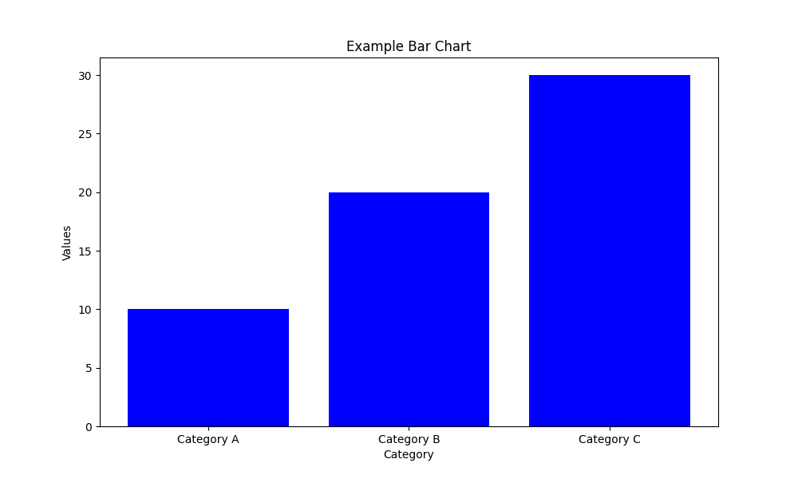
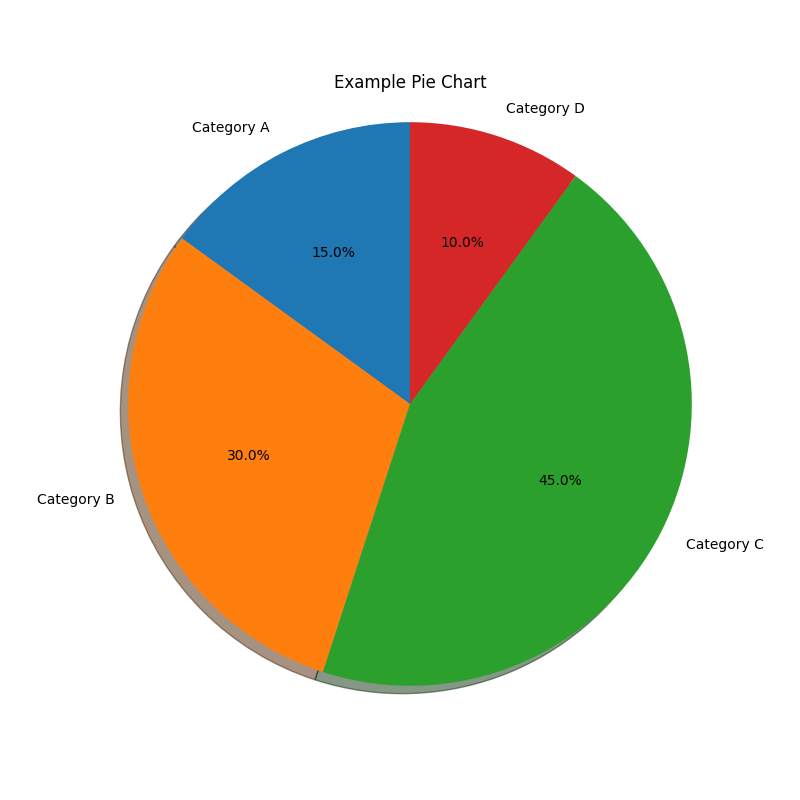
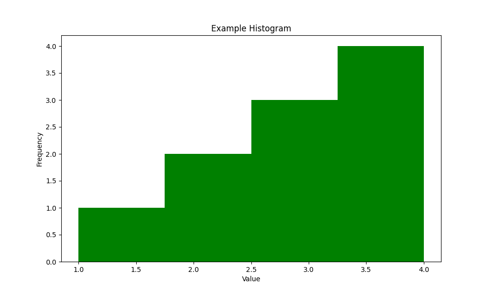
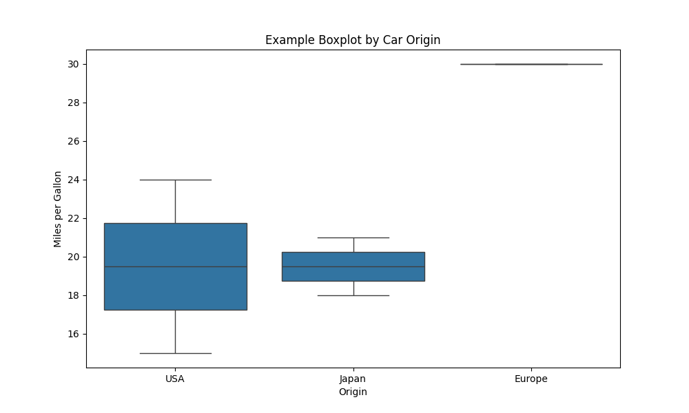
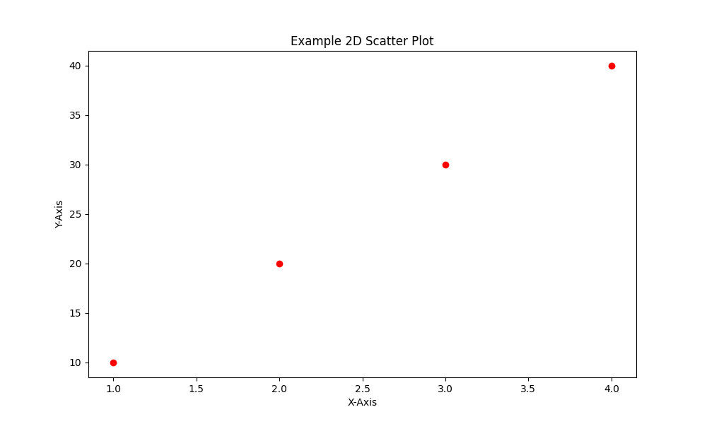
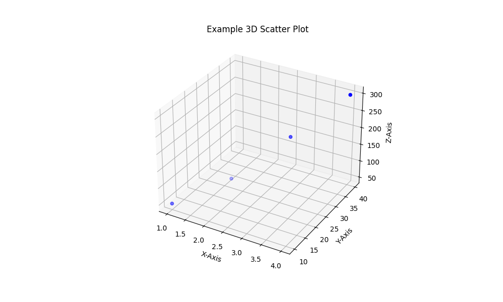

# Statistical Methods for Data Science (statsToolkit)
The project is sponsored by **Malmö Universitet** developed by Eng. Marco Schivo and Eng. Alberto Biscalchin under the supervision of Associete Professor Yuanji Cheng and is released under the **MIT License**. It is open source and available for anyone to use and contribute to.

Internal course Code reference: MA660E

---

# Descriptive Statistics

This module contains basic descriptive statistics functions that allow users to perform statistical analysis on numerical datasets. The functions are designed for flexibility and ease of use, and they provide essential statistical metrics such as mean, median, range, variance, standard deviation, and quantiles.

## Functions Overview

### 1. `mean(X)`
Calculates the arithmetic mean (average) of a list of numbers.

#### Example Usage:

```python
from statstoolkit.statistics import mean

data = [1, 2, 3, 4, 5]
print(mean(data))  # Output: 3.0
```

### 2. `median(X)`
Calculates the median of a list of numbers. The median is the middle value that separates the higher half from the lower half of the dataset.

#### Example Usage:

```python
from statstoolkit.statistics import median

data = [1, 2, 3, 4, 5]
print(median(data))  # Output: 3
```

### 3. `range_(X)`
Calculates the range, which is the difference between the maximum and minimum values in the dataset.

#### Example Usage:

```python
from statstoolkit.statistics import range_

data = [1, 2, 3, 4, 5]
print(range_(data))  # Output: 4
```

### 4. `var(X, ddof=0)`
Calculates the variance of the dataset. Variance measures the spread of the data from the mean. You can calculate both population variance (`ddof=0`) or sample variance (`ddof=1`).

#### Example Usage:

```python
from statstoolkit.statistics import var

data = [1, 2, 3, 4, 5]
print(var(data))  # Output: 2.0  (Population variance)
print(var(data, ddof=1))  # Output: 2.5  (Sample variance)
```

Here's the updated README section with the comparative table and an adjusted usage example:

---

### 5. `std(A, w=0, dim=None, vecdim=None, missingflag=None)`
Calculates the standard deviation similar to MATLAB's `std` function, with options for dimension selection, weighting, and handling of missing values.

### Key Differences Between `std` Implementation and MATLAB's `std`

The Python `std` function has been customized to closely replicate MATLAB’s behavior, but certain nuances exist:

1. **Multidimensional Array Handling**: MATLAB handles 3D and 4D arrays by operating on the first non-singleton dimension by default, while Python’s version requires specifying dimensions to precisely match MATLAB’s output, especially for slice-by-slice or full-array calculations.

2. **NaN Treatment**: Both implementations allow for ignoring or including NaN values, but MATLAB’s “omitmissing” and “includemissing” options directly influence the calculations, while Python requires NaN handling in pre-processing to fully mimic MATLAB’s exact treatment.

3. **Weighted Standard Deviation**: MATLAB’s `std` includes weighted standard deviation handling across rows, columns, or other dimensions. Our Python version achieves similar results when weights are provided, but some variation can occur depending on array shape and dimension settings.

4. **Dimension-Specific Calculations**: MATLAB’s function allows for flexible calculations over specified dimensions, including non-contiguous dimensions (`vecdim`). Python handles contiguous dimensions but may yield different shapes unless explicitly set to match MATLAB’s squeeze behavior.

#### Comparison Table of `std` Results Between MATLAB and Python Implementations

| **Test** | **Description**                             | **MATLAB Result**                                       | **Python Result**                                      | **Match?** |
|----------|--------------------------------------------|---------------------------------------------------------|--------------------------------------------------------|------------|
| **1**    | 1D Array (Default)                         | 7.9057                                                  | (7.905694150420948, 20.0)                              | ✅         |
| **2**    | 1D Array with Weight (w=1)                 | [212.1320, 212.1320, 212.1320]                          | [212.13203436, 212.13203436, 212.13203436]             | ✅         |
| **3**    | 3D Array, default (slice-by-slice)         | [2.5000, 7.7460, 4.5735] (3 slices)                     | [5.50151494, 5.4283208]                                | ❌         |
| **4**    | 2D Array, Default                          | 6.2361                                                  | (6.236095644623236, 18.333333333333332)                | ✅         |
| **5**    | 2D Array with NaN                          | 7.0711                                                  | (7.0710678118654755, 60.0)                             | ✅         |
| **6**    | 2D Array, Row-wise                         | 10                                                     | (7.0710678118654755, 20.0)                             | ❌         |
| **7**    | 2D Array, Weighted, w=1                    | [[1.0000, 2.0817, 3.2146], [1.0000, 1.0000, 1.5275]]    | [[2.0000, 2.0000], [4.0000, 3.0000], [4.0000, 3.0550]] | ❌         |
| **8**    | 3D Array with NaN, omitmissing             | 0                                                      | (0.0, 1000.0)                                         | ✅         |
| **9**    | 2D Array with NaN, includemissing          | 2.7386                                                  | (2.7386127875258306, 5.0)                              | ✅         |
| **10**   | All Elements, 2D Array                     | 9.9897                                                  | (9.87527045694513, 49.54743292509804)                  | ❌         |
#### Example Usage:

```python
from statstoolkit.statistics import std

data = [[1, 2, 3], [4, 5, 6], [7, 8, 9]]
# Default standard deviation
std_result, mean_result = std(data)
print("Standard Deviation:", std_result)
print("Mean:", mean_result)

# With dimension specified
std_dim_result, mean_dim_result = std(data, dim=1)
print("Standard Deviation along dimension 1:", std_dim_result)
print("Mean along dimension 1:", mean_dim_result)

# With NaN handling
data_with_nan = [[1, np.nan, 3], [4, 5, np.nan]]
std_nan_result, mean_nan_result = std(data_with_nan, missingflag="omitmissing")
print("Standard Deviation with NaN omitted:", std_nan_result)
print("Mean with NaN omitted:", mean_nan_result)
```

This updated `std` function mimics MATLAB's `std` behavior with extra parameters for more flexible control, including multi-dimensional weighting and specific handling of missing data.

### 6. `quantile(X, Q)`
Calculates the quantile, which is the value below which a given percentage of the data falls. For example, the 0.25 quantile is the first quartile (25th percentile).

#### Example Usage:

```python
from statstoolkit.statistics import quantile

data = [1, 2, 3, 4, 5]
print(quantile(data, 0.25))  # Output: 2.0 (25th percentile)
print(quantile(data, 0.5))  # Output: 3.0 (Median)
print(quantile(data, 0.75))  # Output: 4.0 (75th percentile)
```

### 7. `corrcoef(x, y, alternative='two-sided', method=None)`
Calculates the Pearson correlation coefficient between two datasets and provides the p-value for testing non-correlation.

#### Example Usage:

```python
from statstoolkit.statistics import corrcoef

x = [1, 2, 3, 4, 5]
y = [2, 4, 6, 8, 10]
R, P = corrcoef(x, y)
print("Correlation coefficient:", R)
print("P-value matrix:", P)
```

### 8. `partialcorr(X, columns=None)`
Computes the partial correlation matrix, controlling for the influence of all other variables.

#### Example Usage:

```python
from statstoolkit.statistics import partialcorr
import pandas as pd

data = pd.DataFrame({
    'A': [1, 2, 3, 4, 5],
    'B': [2, 4, 6, 8, 10],
    'C': [5, 6, 7, 8, 9]
})
partial_corr_matrix = partialcorr(data)
print(partial_corr_matrix)
```

### 9. `cov(data1, data2=None)`
Calculates the covariance matrix between two datasets or within a single dataset.

#### Example Usage:

```python
from statstoolkit.statistics import cov

data1 = [1, 2, 3, 4]
data2 = [2, 4, 6, 8]
print(cov(data1, data2))
```

### 10. `fitlm(x, y)`
Performs simple linear regression of `y` on `x`, returning a dictionary of regression results.

#### Example Usage:

```python
from statstoolkit.statistics import fitlm

x = [1, 2, 3, 4]
y = [2, 4, 6, 8]
result = fitlm(x, y)
print(result)
```

### 11. `anova(y=None, factors=None, data=None, formula=None, response=None, sum_of_squares='type I')`
Performs one-way, two-way, or N-way Analysis of Variance (ANOVA) on data, supporting custom models.

#### Example Usage:

```python
from statstoolkit.statistics import anova
import pandas as pd

data = pd.DataFrame({
    'y': [23, 25, 20, 21],
    'A': ['High', 'Low', 'High', 'Low'],
    'B': ['Type1', 'Type2', 'Type1', 'Type2']
})
result = anova(y='y', data=data, formula='y ~ A + B + A:B')
print(result)
```

### 12. `kruskalwallis(x, group=None, displayopt=False)`
Performs the Kruskal-Wallis H-test for independent samples, a non-parametric alternative to one-way ANOVA.

#### Example Usage:

```python
from statstoolkit.statistics import kruskalwallis

x = [1.2, 3.4, 5.6, 1.1, 3.6, 5.5]
group = ['A', 'A', 'A', 'B', 'B', 'B']
p_value, anova_table, stats = kruskalwallis(x, group=group, displayopt=True)
print("P-value:", p_value)
print(anova_table)
```

---

# Visualization Functions

This module contains several flexible visualization functions built using **Matplotlib** and **Seaborn**, allowing users to generate commonly used plots such as bar charts, pie charts, histograms, boxplots, and scatter plots. The visualizations are designed for customization, giving the user control over various parameters such as color, labels, figure size, and more.

## Functions Overview

### 1. `bar_chart(x, y, title=None, xlabel=None, ylabel=None, color=None, figsize=(10, 6), **kwargs)`
Creates a bar chart with customizable x-axis labels, y-axis values, title, colors, and more.

#### Example Usage:
```python
from statstoolkit.visualization import bar_chart

categories = ['Category A', 'Category B', 'Category C']
values = [10, 20, 30]

bar_chart(categories, values, title="Example Bar Chart", xlabel="Category", ylabel="Values", color="blue")
```


---

### 2. `pie_chart(sizes, labels=None, title=None, colors=None, explode=None, autopct='%1.1f%%', shadow=False, startangle=90, **kwargs)`
Creates a pie chart with options for custom labels, colors, explode effect, and more.

#### Example Usage:
```python
from statstoolkit.visualization import pie_chart

sizes = [15, 30, 45, 10]
labels = ['Category A', 'Category B', 'Category C', 'Category D']

pie_chart(sizes, labels=labels, title="Example Pie Chart", autopct='%1.1f%%', shadow=True)
```


---

### 3. `histogram(x, bins=10, title=None, xlabel=None, ylabel=None, color=None, figsize=(10, 6), **kwargs)`
Creates a histogram for visualizing the frequency distribution of data. The number of bins or bin edges can be adjusted.

#### Example Usage:
```python
from statstoolkit.visualization import histogram

data = [1, 2, 2, 3, 3, 3, 4, 4, 4, 4]

histogram(data, bins=4, title="Example Histogram", xlabel="Value", ylabel="Frequency", color="green")
```


---

### 4. `boxplot(MPG, origin=None, title=None, xlabel=None, ylabel=None, color=None, figsize=(10, 6), **kwargs)`
Creates a boxplot for visualizing the distribution of a dataset. It supports optional grouping variables, such as plotting the distribution of MPG (miles per gallon) by car origin.

#### Example Usage:
```python
from statstoolkit.visualization import boxplot

MPG = [15, 18, 21, 24, 30]
origin = ['USA', 'Japan', 'Japan', 'USA', 'Europe']

boxplot(MPG, origin=origin, title="Example Boxplot by Car Origin", xlabel="Origin", ylabel="Miles per Gallon")
```


---

### 5. `scatterplot(x, y, z=None, symbol='o', title=None, xlabel=None, ylabel=None, color=None, figsize=(10, 6), **kwargs)`
Creates a scatter plot, optionally supporting 3D-like plots where a third variable `z` can be mapped to point sizes or colors. Marker symbols and other plot properties can be customized.

#### Example Usage (2D Scatter Plot):
```python
from statstoolkit.visualization import scatterplot

x = [1, 2, 3, 4]
y = [10, 20, 30, 40]

scatterplot(x, y, title="Example 2D Scatter Plot", xlabel="X-Axis", ylabel="Y-Axis", color="red")
```


#### Example Usage (3D-like Scatter Plot):
```python
from statstoolkit.visualization import scatterplot_3d

x = [1, 2, 3, 4]
y = [10, 20, 30, 40]
z = [50, 100, 200, 300]

scatterplot_3d(x, y, z, symbol="o", title="Example 3D Scatter Plot", xlabel="X-Axis", ylabel="Y-Axis", zlabel="Z-Axis", color="blue")
```


---
# Probability

### 1. `binopdf(k, n, p)`
Calculates the binomial probability mass function for given trials and success probability.

#### Example Usage:

```python
from statstoolkit.probability import binopdf

k = 3  # number of successes
n = 10  # number of trials
p = 0.5  # probability of success
print(binopdf(k, n, p))  # Output: probability of exactly 3 successes
```

### 2. `poisspdf(k, mu)`
Calculates the Poisson probability mass function for given mean number of events.

#### Example Usage:

```python
from statstoolkit.probability import poisspdf

k = 5  # number of events
mu = 3  # mean number of events
print(poisspdf(k, mu))  # Output: probability of exactly 5 events
```

### 3. `geopdf(k, p)`
Calculates the geometric probability mass function for the number of trials needed to get the first success.

#### Example Usage:

```python
from statstoolkit.probability import geopdf

k = 3  # number of trials
p = 0.5  # probability of success
print(geopdf(k, p))  # Output: probability of success on the 3rd trial
```

### 4. `nbinpdf(k, r, p)`
Calculates the negative binomial probability mass function, where `k` is the number of failures until `r` successes occur.

#### Example Usage:

```python
from statstoolkit.probability import nbinpdf

k = 4  # number of failures
r = 2  # number of successes
p = 0.5  # probability of success
print(nbinpdf(k, r, p))  # Output: probability of exactly 4 failures before 2 successes
```

### 5. `hygepdf(k, M, n, N)`
Calculates the hypergeometric probability mass function for the probability of drawing `k` successes from a population of `M`, with `n` successes in the sample.

#### Example Usage:

```python
from statstoolkit.probability import hygepdf

k = 3  # successes in sample
M = 50  # population size
n = 20  # sample size
N = 10  # number of successes in population
print(hygepdf(k, M, n, N))  # Output: probability of drawing 3 successes
```

### 6. `betapdf(x, a, b)`
Calculates the beta probability density function.

#### Example Usage:

```python
from statstoolkit.probability import betapdf

x = 0.5
a = 2  # shape parameter alpha
b = 2  # shape parameter beta
print(betapdf(x, a, b))  # Output: beta distribution density at x=0.5
```

### 7. `chi2pdf(x, df)`
Calculates the chi-squared probability density function.

#### Example Usage:

```python
from statstoolkit.probability import chi2pdf

x = 5
df = 3  # degrees of freedom
print(chi2pdf(x, df))  # Output: chi-squared density at x=5
```

### 8. `exppdf(x, scale)`
Calculates the exponential probability density function.

#### Example Usage:

```python
from statstoolkit.probability import exppdf

x = 2
scale = 1  # inverse of rate parameter lambda
print(exppdf(x, scale=scale))  # Output: exponential density at x=2
```

### 9. `fpdf(x, dfn, dfd)`
Calculates the F-distribution probability density function.

#### Example Usage:

```python
from statstoolkit.probability import fpdf

x = 1.5
dfn = 5  # degrees of freedom numerator
dfd = 2  # degrees of freedom denominator
print(fpdf(x, dfn, dfd))  # Output: F-distribution density at x=1.5
```

### 10. `normpdf(x, mu, sigma)`
Calculates the normal (Gaussian) probability density function.

#### Example Usage:

```python
from statstoolkit.probability import normpdf

x = 0
mu = 0  # mean
sigma = 1  # standard deviation
print(normpdf(x, mu, sigma))  # Output: normal density at x=0
```

### 11. `lognpdf(x, s, scale)`
Calculates the log-normal probability density function.

#### Example Usage:

```python
from statstoolkit.probability import lognpdf

x = 1.5
s = 0.5  # shape parameter
scale = 1  # scale parameter
print(lognpdf(x, s, scale=scale))  # Output: log-normal density at x=1.5
```

### 12. `tpdf(x, df)`
Calculates the Student's t probability density function.

#### Example Usage:

```python
from statstoolkit.probability import tpdf

x = 2
df = 10  # degrees of freedom
print(tpdf(x, df))  # Output: t-distribution density at x=2
```

### 13. `wblpdf(x, c, scale)`
Calculates the Weibull probability density function.

#### Example Usage:

```python
from statstoolkit.probability import wblpdf

x = 1.2
c = 2  # shape parameter
scale = 1  # scale parameter
print(wblpdf(x, c, scale=scale))  # Output: Weibull density at x=1.2
```

---

## License

This project is licensed under the MIT License - see the [LICENSE](LICENSE) file for details.

---
